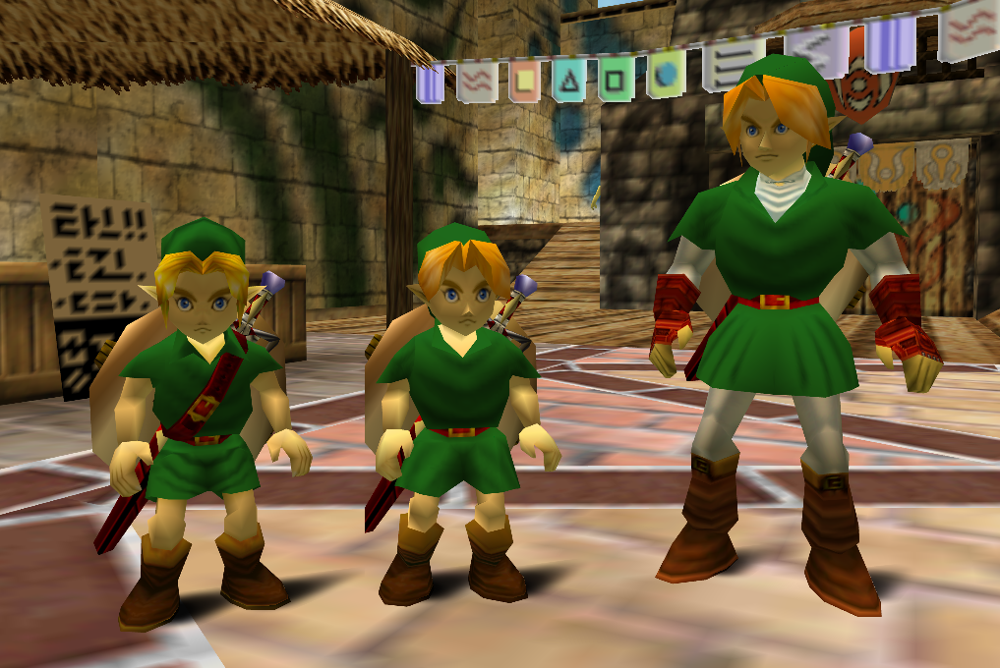

# Majora's Mask: Recompiled Ocarina of Time Link Mod

This is a mod for Majora's Mask: Recompiled that lets you change Link to be his Ocarina of Time counterpart.

You can choose to be either child or adult Link from OoT, or switch back to the orginal MM Link if desired.
 **(You need to reload the current scene for this to take effect.)**

There is also an option named `Fix Color`, only disable this if you are using another mod which alters tunic colors.

There may be many problems with this mod, so be sure to leave any you encounter in the [GitHub Issues Page](https://github.com/ThatHypedPerson/MMRecompOoTLink/issues).

Thanks to LittleCube for testing the mod and adding the Vanilla option, along with everyone else in the N64 Recomp Modding Discord.

## Mod Template README

### Writing mods
See [this document](https://hackmd.io/fMDiGEJ9TBSjomuZZOgzNg) for an explanation of the modding framework, including how to write function patches and perform interop between different mods.

### Tools
You'll need to install `clang` and `make` to build this template.
* On Windows, using [chocolatey](https://chocolatey.org/) to install both is recommended. The packages are `llvm` and `make` respectively.
  * The LLVM 19.1.0 [llvm-project](https://github.com/llvm/llvm-project) release binary, which is also what chocolatey provides, does not support MIPS correctly. The solution is to install 18.1.8 instead, which can be done in chocolatey by specifying `--version 18.1.8` or by downloading the 18.1.8 release directly.
* On Linux, these can both be installed using your distro's package manager.
* On MacOS, these can both be installed using Homebrew. Apple clang won't work, as you need a mips target for building the mod code.

On Linux and MacOS, you'll need to also ensure that you have the `zip` utility installed.

You'll also need to build [N64Recomp](https://github.com/N64Recomp/N64Recomp) for the `RecompModTool` utility.

### Building
* First, run `make` (with an optional job count) to build the mod code itself.
* Next, run the `RecompModTool` utility with `mod.toml` as the first argument and the build dir (`build` in the case of this template) as the second argument.
  * This will produce your mod's `.nrm` file in the build folder.